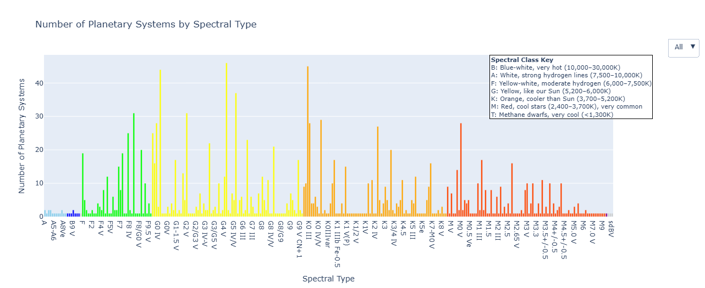
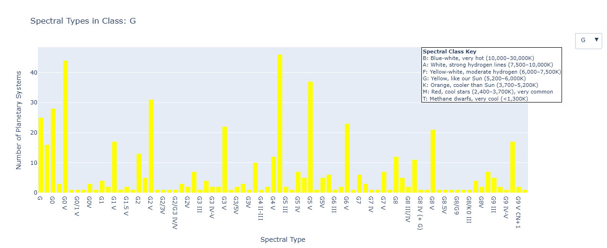
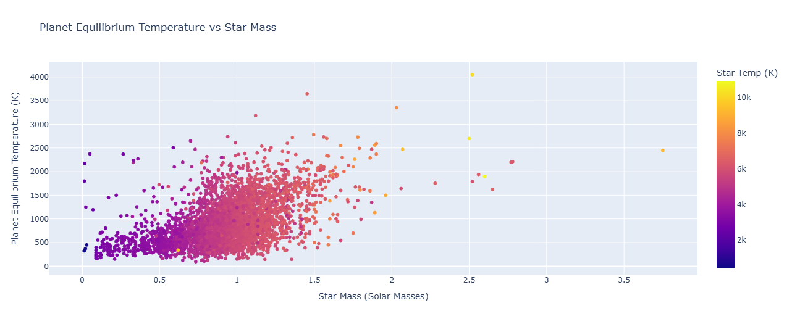

# Project Report - CS 625, Spring 2025

Bhargav Iyer

Due: April 20, 2025

## Dataset

Stars are the birthplaces of planets, and their properties—like mass, temperature, and spectral type—can significantly influence the characteristics of orbiting planets. Understanding how planetary systems vary across different types of stars can give us insights into planet formation, system evolution, and even where life might be more likely to exist. With thousands of discovered exoplanets, we can now visualize patterns in real data to better understand our cosmic neighborhood.  I have always been interested in planets and stars and want to learn more about it through visualizing it.

The Planetary Systems Composite Parameters Planet Data table (PSCompPars) is a compilation of system, stellar, and planetary parameters for known Confirmed Exoplanets. The purpose of this table is to enable a more statistical view of the known exoplanet population and their host environments.  I am using the different features such as stellar temperature, stellar mass, planet's equilibrium temperature, and Stellar Types (Type of Star a planet is orbitting) to create these visualizations in order to answer/create more questions.

Link:  https://exoplanetarchive.ipac.caltech.edu/cgi-bin/TblView/nph-tblView?app=ExoTbls&config=PSCompPars

(NASA Exoplanet Archive data comes from a combination of sources and is curated by NASA and Caltech/IPAC (Infrared Processing and Analysis Center))

### Heading: How Stellar Properties Shape Planetary Systems: From Spectral Types to Planet Temperatures

Google Colab Link:  https://colab.research.google.com/drive/1MfrZfGzV36b73c6dDuFIqGujQvZRYPOR#scrollTo=LvNL5X283BAZ

## How does the number of known planets vary across different spectral types of stars?

Idiom: Histogram Chart / Mark Color
| Data: Attribute | Data: Attribute Type  | Encode: Channel | 
| --- |---| --- |
| Stellar Type | key, categorical | vertical spatial region (y-axis) |
| Number of Planets | value, quantitative | horizontal position on a common scale (x-axis) |

The above visualization shows an example of the dropdown and filtering through all the different spectral types.  The visualization can also be further zoomed in to learn more.

The first visualization is an interactive bar chart showing the number of confirmed exoplanets discovered around stars of different spectral types, grouped by their initial letter (O, B, A, F, G, K, M). These spectral classes, which reflect the stars’ temperature and color, range from hot, blue O-type stars to cool, red M-type stars. Users can filter the chart using a dropdown menu to explore more detailed spectral subtypes (e.g., K2V, K3V), hover over bars to view exact counts, and zoom in and out to view as much as what the user wants to see. This interactivity allows viewers to identify trends, such as the noticeably higher number of planets found around cooler M-type stars—possibly due to their abundance and proximity to Earth—while also highlighting the scarcity of planets around hotter, shorter-lived O and B stars. This visualization introduces the broader narrative by allowing the user to explore how planet-hosting likelihood varies by star type, setting the foundation for deeper analysis of the environments those stars create.

In the histogram, we directly explore how different types of stars (grouped by spectral class) influence the number of known planets discovered around them. This helps answer whether certain types of stars (like cooler M-type stars) are more likely to host planets than others (like rare, hot O-type stars). The chart visually establishes a key part of the story: stellar characteristics—like temperature and classification—are not just labels, but are fundamentally linked to the likelihood of planet formation and detection.

## How does a planet’s equilibrium temperature relate to its host star’s mass and temperature?

Idiom: Scatterplot Chart / Mark Color
| Data: Attribute | Data: Attribute Type  | Encode: Channel | 
| --- |---| --- |
| Stellar Mass | value, quantitative | vertical spatial region (y-axis) |
| Planet Equilibrium Temperature | value, quantitative | horizontal position on a common scale (x-axis) |

The second visualization—a scatter plot—examines how stellar properties such as temperature and mass influence the thermal environment of their orbiting planets, measured through planetary equilibrium temperature (pl_eqt). The x-axis shows the star’s mass, while the y-axis shows the planet’s equilibrium temperature, with color encoding representing the star’s effective temperature. This visualization allows users to explore how hotter, more massive stars tend to host warmer planets, revealing a positive correlation between stellar and planetary temperatures. Additionally, outliers—such as cooler planets orbiting hot stars—highlight interesting cases potentially due to large orbital distances. Interactive features like zooming, panning, and hover tooltips enhance the user’s ability to dive into specific planetary systems, making the visualization both informative and engaging.

Based on the visualization, I thought there might be some sort of math that might explain this. I found out that a star’s mass is one of the most fundamental factors determining its physical properties, including its effective temperature—the surface temperature that defines the star’s thermal radiation. More massive stars have stronger gravitational forces, which leads to greater pressure and temperature in their cores, fueling faster and more intense nuclear fusion reactions. This increased fusion rate produces significantly more energy, which radiates outward and results in a hotter surface. As a result, stars with greater mass tend to have higher effective temperatures and often appear blue or white, while lower-mass stars burn their fuel more slowly, have cooler surfaces, and appear red or orange. This relationship helps define the stellar classification system from hot, massive O- and B-type stars to cooler, less massive M-type stars.  This whole concept can be mathematically found using the Stefan–Boltzmann law.

This visualization directly supports the headline "How Stellar Properties Shape Planetary Systems: From Spectral Types to Planet Temperatures" by transitioning from which stars host planets (covered in the first chart) to how those stars physically influence the conditions on their planets. It underscores the second part of the story: not only do stellar types determine the likelihood of hosting planets, they also shape the environmental conditions of those planets—potentially affecting habitability and composition.

## Final Thoughts
Developing this visualization project using the NASA Exoplanet Archive dataset was an insightful and rewarding experience. The overall process—from formulating meaningful questions, exploring the dataset, to building interactive visualizations—took approximately 12–15 hours spread across several sessions.

1. Initial Data Exploration & Question Design (3–4 hours):
- Understanding the structure and richness of the dataset took a significant amount of time. It involved filtering for the most reliable fields (e.g., pl_eqt, st_teff, st_mass, st_spectype) and crafting questions that would go beyond simple descriptive stats to uncover meaningful patterns.

2. Visualization Development (6–7 hours):
- This was the most time-consuming phase. Building interactive visualizations with Plotly required careful selection of chart types, tuning layout aesthetics, and implementing features like dropdowns and sliders to make the experience intuitive and engaging. Debugging interactivity issues—especially around grouping spectral types and enabling responsive filtering—also added to the workload.

3. Narrative Structuring & Storytelling (2–3 hours):
- Connecting both visualizations into a cohesive story took focused effort. The challenge was not just in explaining what the visualizations show, but why those insights matter scientifically. Writing the narrative to logically progress from general patterns (planet counts by star type) to specific conditions (planetary equilibrium temperatures) helped reinforce the value of the data.

## References

* Reference 1, <https://exoplanetarchive.ipac.caltech.edu/cgi-bin/TblView/nph-tblView?app=ExoTbls&config=PSCompPars>
* Reference 2, <https://colab.research.google.com/drive/1MfrZfGzV36b73c6dDuFIqGujQvZRYPOR#scrollTo=LvNL5X283BAZ>
* Reference 3, <https://www.e-education.psu.edu/astro801/content/l7_p3.html>
* Reference 4, <https://www.open.edu/openlearn/mod/oucontent/view.php?id=20882&section=3.2>
* Reference 5, <https://plotly.com/python/>
* Reference 6, <https://htmlcolorcodes.com/>
